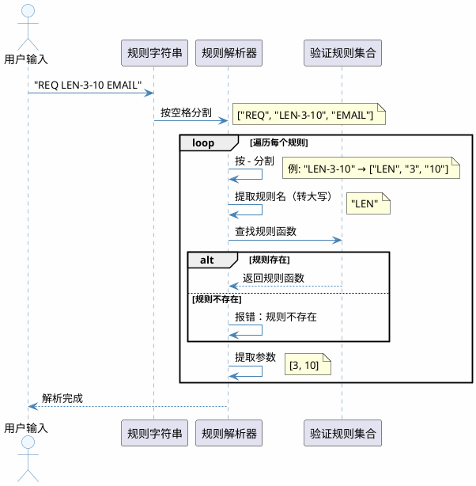
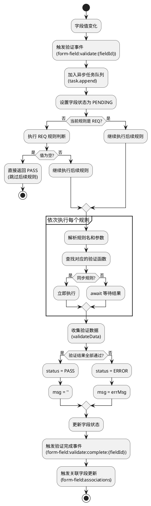
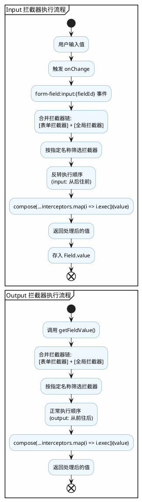
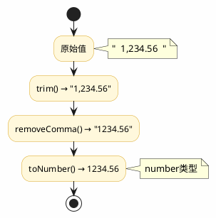

# react-form


### 描述

用于表单的校验


### 安装

```shell
npm i --save @kne/react-form
```


### 概述

react-form 是一个轻量级且功能强大的 React 表单库，专为现代化应用设计，提供了简洁的 API 和完整的表单管理解决方案。

### 核心特性

#### 📦 轻量级状态管理
- 基于 React Context + State，零额外依赖
- 📊 支持嵌套分组和复杂数据结构
- ⚡ 实时状态更新，O(1) 高效数据访问

#### 🎛️ 灵活字段控制
- 🔧 `useField` Hook，字段级精细化控制
- 🔗 支持字段级拦截器与关联联动
- 🛡️ 内置防抖，智能去空值处理

#### 📡 事件驱动架构
- 🎯 基于事件发射器的解耦设计
- 📢 支持表单/字段/分组三级事件监听
- 🔌 便于扩展和自定义

#### ✅ 强大验证系统
- 🔶 内置规则：必填、手机号、邮箱、长度等
- 🌐 支持异步远程验证
- 📝 可自定义规则与错误提示

#### 📁 分组管理
- 🔄 支持无限嵌套分组结构
- ➕ GroupList 动态增删，轻松管理
- 📊 支持分组级数据批量操作

#### 🎮 表单 API
- 🪝 `useFormApi` Hook，完整操作能力
- 📥📤 支持获取/设置表单数据
- 🎯 支持字段级验证控制

### Form 组件设计理念

#### 设计原则
Form 组件采用分层架构设计，将表单管理、状态管理、事件处理、验证逻辑等职责分离，通过 Context 进行数据传递，实现了高度解耦和可扩展性。

#### 核心架构

##### 1. Context 层
Form 通过 Provider 将表单的核心能力传递给子组件，包括：

- `emitter` - 事件发射器，负责表单内部的事件通信
- `openApi` - 表单操作接口，提供数据获取、设置、验证等方法
- `task` - 任务管理器，处理异步任务队列
- `formState` - 表单状态，使用 Map 存储所有字段的状态
- `setFormState` - 表单状态更新函数
- `formIsMount` - 表单挂载状态
- `rules` - 验证规则集合，包含内置规则和自定义规则
- `interceptor` - 拦截器配置
- `onSubmit` / `onError` - 提交和错误回调

##### 2. Provider 层次结构

```
Form (根组件)
  ├─ Provider (Context 传递)
  │   ├─ FormApiProvider (封装 openApi)
  │   │   └─ FormEvent (事件监听和处理)
  │   │       └─ children (表单字段)
```

##### 3. 事件驱动机制

Form 使用事件发射器模式，支持以下事件类型：

**表单级别事件**：
- `form:submit` - 表单提交
- `form:submit:complete` - 提交完成
- `form:reset` - 表单重置
- `form:validate` - 表单验证
- `form:set-data` - 设置表单数据
- `form:set-fields` - 设置字段属性

**字段级别事件**：
- `form-field:validate:{fieldId}` - 字段验证
- `form-field:change:{fieldId}` - 字段值变化

**分组级别事件**：
- `form-group:change` - 分组数据变化
- `form-group:remove` - 分组移除

##### 4. 状态管理设计

**字段状态** (Field 类)：
每个字段都有独立的状态对象，包含：
- `id` - 字段唯一标识
- `name` - 字段名称
- `groupName` - 所属分组名称
- `groupIndex` - 分组索引
- `value` - 字段值
- `label` - 字段标签
- `rule` - 验证规则
- `validate` - 验证状态（INIT/PENDING/PASS/ERROR）
- `errMsg` - 错误信息

**表单状态**：
使用 Map 结构存储所有字段状态，通过 `formStateRef.current` 持有引用，确保状态更新的一致性。

##### 5. API 设计

**openApi 提供的操作方法**：

| 类别 | 方法 | 说明 |
|------|------|------|
| 数据操作 | `data` / `set data()` | 获取/设置表单数据 |
| | `getFormData()` / `setFormData()` | 获取/设置表单数据 |
| | `getField()` / `getFields()` | 获取单个/多个字段 |
| | `setField()` / `setFields()` | 设置单个/多个字段属性 |
| | `setFieldValue()` | 设置字段值 |
| 验证操作 | `validateField()` | 验证单个字段 |
| | `validateAll()` | 验证所有字段 |
| | `setFieldValidate()` | 设置字段验证状态 |
| | `isPass` | 判断表单是否通过验证 |
| 错误处理 | `errors` | 获取所有错误信息 |
| 表单控制 | `submit()` | 提交表单 |
| | `reset()` | 重置表单 |
| | `onReady()` | 表单就绪回调 |
| | `onDestroy()` | 表单销毁回调 |

##### 6. 验证规则解析与执行流程

**验证规则格式**：
验证规则支持三种格式：
1. **字符串格式**：`"REQ LEN-3-10 EMAIL"` - 空格分隔多个规则
2. **函数格式**：自定义验证函数
3. **正则表达式**：直接使用正则验证

**规则字符串解析规则**：
```
规则格式：{RULE_NAME}-{arg1}-{arg2}-{arg3}...

示例：
- "REQ"              → 规则名：REQ，无参数
- "LEN-3-10"         → 规则名：LEN，参数：min=3, max=10
- "REQ LEN-3-10"     → 多个规则组合
```



解析步骤：
1. 按空格分割规则字符串 → `["REQ", "LEN-3-10"]`
2. 对每个规则按 `-` 分割 → `["LEN", "3", "10"]`
3. 第一部分为规则名（转为大写匹配） → `LEN`
4. 后续部分为规则参数 → `[3, 10]`

**规则执行流程**：



**内置验证规则**：

| 规则名 | 参数 | 说明 | 验证逻辑 | 错误提示 |
|--------|------|------|---------|---------|
| `REQ` | 无 | 必填验证 | 值非空（null/undefined/''） | - |
| `TEL` | 无 | 手机号验证 | 匹配 `/^1[0-9]{10}$/` | "请输入有效的手机号" |
| `EMAIL` | 无 | 邮箱验证 | 匹配邮箱正则 | "请输入有效的邮箱" |
| `LEN` | min, max | 长度验证 | min ≤ 长度 ≤ max | "%s长度必须大于min/小于max/等于min" |

**自定义验证规则**：

规则函数接收参数：`(value, ...args, { data, field })`

```javascript
// 同步验证规则
rules: {
  PASSWORD_STRENGTH: (value, level, { data }) => {
    const strength = checkStrength(value);
    return {
      result: strength >= level,
      errMsg: strength >= level ? '' : '密码强度不足',
      data: { strength }
    };
  }
}

// 异步验证规则
rules: {
  CHECK_UNIQUE: async (value, { field }) => {
    const exists = await api.checkUnique(field.name, value);
    return {
      result: !exists,
      errMsg: exists ? '该值已存在' : ''
    };
  }
}

// 使用数据联动
rules: {
  MATCH_PASSWORD: (value, { data }) => {
    return {
      result: value === data.password,
      errMsg: '两次输入的密码不一致'
    };
  }
}
```

**规则使用示例**：

```javascript
// 单个规则
rule="REQ"

// 多个规则组合
rule="REQ LEN-3-10 EMAIL"

// 使用自定义规则
rule="REQ CHECK_UNIQUE PASSWORD_STRENGTH-3"
```

##### 7. 拦截器系统详解

**拦截器类型**：

| 类型 | 执行时机 | 用途 | 方向 |
|------|---------|------|------|
| `input` | 值存入表单前 | 数据清理、转换、规范化 | 外部 → 内部 |
| `output` | 值从表单取出时 | 数据格式化、转换 | 内部 → 外部 |

**拦截器注册机制**：

```javascript
// 全局拦截器（所有表单共享）
import { interceptors } from 'react-form';

// 注册输入拦截器
interceptors.input.use('trim', value => value.trim());

// 注册输出拦截器
interceptors.output.use('formatDate', value => {
  return value ? new Date(value).toISOString() : null;
});

// 注册数字格式化
interceptors.output.use('number', value => {
  return value ? parseFloat(value) : 0;
});
```

**表单级拦截器**（优先级高于全局）：

```javascript
<Form
  interceptors={{
    input: [
      {
        name: 'customTrim',
        exec: value => value.trim()
      }
    ],
    output: [
      {
        name: 'uppercase',
        exec: value => value.toUpperCase()
      }
    ]
  }}
>
```

**字段级拦截器配置**：

```javascript
<Input
  name="email"
  rule="EMAIL"
  interceptor="trim"  // 指定使用的拦截器
/>
```

**拦截器执行流程**：



**拦截器链式执行示例**：



```javascript
// 配置多个拦截器
<Input
  name="price"
  interceptor="trim,removeComma,toNumber"
/>
```

**拦截器优先级**：

```
优先级从高到低：
1. 字段指定拦截器
2. 表单级拦截器
3. 全局拦截器

同名拦截器：后注册的覆盖先注册的
```

**内置拦截器使用**：

```javascript
import { interceptors } from 'react-form';

// 常用输入拦截器
interceptors.input.use('trim', v => v?.trim?.());
interceptors.input.use('toUpperCase', v => v?.toUpperCase?.());
interceptors.input.use('toLowerCase', v => v?.toLowerCase?.());
interceptors.input.use('removeComma', v => v?.replace?.(/,/g, ''));

// 常用输出拦截器
interceptors.output.use('toNumber', v => v ? parseFloat(v) : null);
interceptors.output.use('formatCurrency', v => v ? \`¥\${v.toFixed(2)}\` : '¥0.00');
interceptors.output.use('defaultEmpty', v => v || '');
```

**完整示例：金额字段处理**：

```javascript
// 注册拦截器
interceptors.input.use('parseMoney', value => {
  // 去除所有非数字字符（保留小数点）
  const cleaned = value.replace(/[^\d.]/g, '');
  // 转换为数字
  return parseFloat(cleaned) || 0;
});

interceptors.output.use('formatMoney', value => {
  // 格式化为千分位
  return value.toLocaleString('zh-CN', {
    style: 'currency',
    currency: 'CNY'
  });
});

// 使用
<Input
  name="amount"
  rule="REQ"
  interceptor="parseMoney,formatMoney"
/>

// 用户输入：10000
// 内部存储：10000 (number)
// 输出展示：¥10,000.00
```

##### 8. 字段关联设计

通过 `associations` 配置实现字段间的联动：

```javascript
{
  fields: [{ name: 'field1' }, { name: 'field2' }],
  callback: ({ target, origin, openApi }) => {
    // 当关联字段变化时，更新目标字段
    openApi.setFieldValue(target, computedValue);
  }
};
```

##### 9. 生命周期管理

**表单生命周期**：

| 阶段 | 触发时机 | 执行操作 |
|------|---------|---------|
| 挂载 | Form 组件首次渲染 | - 初始化 formState (Map 结构)<br>- 创建事件发射器<br>- 初始化 openApi<br>- 设置初始数据<br>- 绑定事件监听器 |
| 更新 | Form 组件属性变化 | - 更新 rules 配置<br>- 更新 interceptors 配置<br>- 处理 data 变化 |
| 卸载 | Form 组件销毁 | - 清理所有事件监听器<br>- 清理异步任务<br>- 释放内存资源 |

**字段生命周期**：

| 阶段 | 状态 | 说明 | 可执行操作 |
|------|------|------|-----------|
| PRE_INIT | 预初始化 | 字段刚创建，尚未绑定到表单状态 | - |
| INIT | 已初始化 | 字段已注册到表单，可以交互 | 获取/设置值、验证、触发事件 |

**字段状态转换流程**：

```
字段创建
  ↓
PRE_INIT (useField 初始化)
  ↓
INIT (字段注册到 formState)
  ↓
用户交互
  ↓
PENDING (正在验证)
  ↓
PASS 或 ERROR (验证结果)
  ↓
用户修改或手动重置
  ↓
INIT (回到初始状态)
```

**验证状态枚举**：

| 状态值 | 枚举名 | 说明 | UI 展示建议 |
|--------|--------|------|------------|
| 0 | INIT | 初始状态 | 不显示错误提示 |
| 1 | PASS | 验证通过 | 不显示错误提示 |
| 2 | ERROR | 验证失败 | 显示错误信息 |
| 3 | PENDING | 验证中 | 显示加载状态 |

##### 10. 验证流程详解

**单个字段验证流程**：

```
1. 触发验证
   ├─ 用户输入 (onChange + 防抖)
   ├─ 失焦事件 (onBlur)
   ├─ 手动调用 validateField()
   └─ 表单提交 (validateAll())
   ↓
2. 查找字段
   ├─ 通过 id 查找
   ├─ 通过 name 查找
   ├─ 通过 groupName + groupIndex + name 查找
   └─ 未找到则跳过
   ↓
3. 解析验证规则
   ├─ 分割规则字符串 (空格分隔)
   ├─ 匹配内置规则 (REQ, TEL, EMAIL, LEN)
   └─ 匹配自定义规则
   ↓
4. 执行验证
   ├─ 更新字段状态为 PENDING
   ├─ 依次执行每个规则
   ├─ 同步规则立即返回结果
   └─ 异步规则等待 Promise
   ↓
5. 处理验证结果
   ├─ 全部通过 → 状态设为 PASS
   ├─ 任意失败 → 状态设为 ERROR，记录错误信息
   └─ 更新 formState
   ↓
6. 触发事件
   ├─ emit('form-field:validate:{fieldId}')
   ├─ 触发关联字段的 associations 回调
   └─ 计算表单整体 isPass 状态
```

**表单整体验证流程**：

```
1. 触发 validateAll()
   ↓
2. 遍历所有字段
   ├─ 对每个字段执行单字段验证流程
   └─ 收集验证结果
   ↓
3. 判断表单状态
   ├─ 所有字段都 PASS → isPass = true
   └─ 存在任意 ERROR 或 PENDING → isPass = false
   ↓
4. 返回验证结果
   └─ 提交处理
```

**验证规则执行顺序**

规则按照声明顺序依次执行，遇到第一个失败的规则即停止。

示例：`rule="REQ LEN-3-20 EMAIL"`

1. 检查必填 (REQ)
2. 检查长度 (LEN-3-20)
3. 检查邮箱格式 (EMAIL)

若第 1 步失败，则不会执行后续检查。

**自定义验证规则**

```javascript
// 同步验证
rules: {
  CUSTOM_RULE: value => {
    return {
      result: value === 'valid',
      errMsg: value === 'valid' ? '' : '验证失败'
    };
  }
}

// 异步验证
rules: {
  CHECK_UNIQUE: async value => {
    const exists = await checkExists(value);
    return {
      result: !exists,
      errMsg: exists ? '该值已存在' : ''
    };
  }
}
```

##### 11. 事件系统详解

**事件类型与触发时机**：

| 事件名称 | 触发时机 | 参数 |
|---------|---------|------|
| `form:submit` | 表单提交时 | (args) - 提交参数 |
| `form:submit:complete` | 提交完成时 | - |
| `form:reset` | 表单重置时 | - |
| `form:validate` | 表单验证时 | - |
| `form:set-data` | 设置表单数据时 | ({ data, runValidate }) |
| `form:set-fields` | 设置字段属性时 | ({ data, runValidate }) |
| `form-group:change` | 分组数据变化时 | ({ parentId, name, list }) |
| `form-group:remove` | 分组移除时 | ({ parentId, name }) |
| `form-field:validate:{fieldId}` | 字段验证时 | - |
| `form-field:change:{fieldId}` | 字段值变化时 | - |
| `form:mount` | 表单挂载完成时 | - |
| `form:unmount` | 表单卸载时 | - |

**事件监听方式**：

```javascript
// 在组件内通过 emitter 监听
const { emitter } = useFormContext();

// 监听表单提交
const submitListener = emitter.addListener('form:submit', (args) => {
  console.log('表单提交', args);
});

// 监听数据变化
const dataListener = emitter.addListener('form:set-data', ({ data }) => {
  console.log('数据变化', data);
});

// 清理监听器
useEffect(() => {
  return () => {
    submitListener.remove();
    dataListener.remove();
  };
}, []);
```

**使用 onReady/onDestroy 钩子**：

```javascript
const formApiRef = useRef();
formApiRef.current.onReady(() => {
  console.log('表单已就绪');
  // 可以在这里执行初始化操作
});

formApiRef.current.onDestroy(() => {
  console.log('表单即将销毁');
  // 可以在这里执行清理操作
});
```

##### 12. 性能优化

- 使用 `useRef` 保存表单状态引用，避免不必要的重渲染
- 使用 `useMemo` 缓存计算结果（如 openApi、分组路径等）
- 事件监听器及时清理，避免内存泄漏
- 防抖处理字段验证，避免频繁触发
- 使用 Map 存储字段状态，查找效率 O(1)

### 使用场景

- 简单的单页表单
- 复杂的多步骤表单流程
- 动态表单字段生成
- 字段间的关联和联动
- 需要精细化控制表单验证的场景


### 示例

#### 示例代码

- 基本示例
- 展示基本的表单使用方式，包括表单绑定、验证规则、提交和重置
- _ReactForm(@kne/current-lib_react-form),antd(antd)

```jsx
const { default: ReactForm, useField, useSubmit, useReset } = _ReactForm;
const { Input: AntInput, Button, Space, Card, Alert, Typography, message } = antd;
const { Text } = Typography;

// ========================================
// 通用组件
// ========================================

const Input = props => {
  const fieldProps = useField(props);
  const isError = fieldProps.errState === 2;
  const isValidating = fieldProps.errState === 3;

  return (
    <div style={{ marginBottom: 16 }}>
      <div style={{ marginBottom: 4 }}>
        <Text type={isError ? 'danger' : undefined}>{fieldProps.label}</Text>
      </div>
      <div>
        <AntInput
          ref={fieldProps.fieldRef}
          type={props.type || 'text'}
          value={fieldProps.value || ''}
          onChange={e => {
            fieldProps.onChange(e.target.value);
            fieldProps.triggerValidate();
          }}
          onBlur={fieldProps.triggerValidate}
          placeholder={props.placeholder}
          status={isError ? 'error' : undefined}
          style={{ width: props.width || 200 }}
        />
        {fieldProps.errMsg && (
          <Text type="danger" style={{ marginLeft: 8, fontSize: 12 }}>
            {fieldProps.errMsg}
          </Text>
        )}
        {isValidating && (
          <Text type="secondary" style={{ marginLeft: 8, fontSize: 12 }}>
            验证中...
          </Text>
        )}
      </div>
    </div>
  );
};

const SubmitButton = ({ children, isPassButton = false }) => {
  const { isLoading, isPass, onClick } = useSubmit();
  return (
    <Button
      type="primary"
      onClick={onClick}
      disabled={isPassButton ? (isLoading || !isPass) : isLoading}
      loading={isLoading}
    >
      {children}
    </Button>
  );
};

const ResetButton = () => {
  const { onClick } = useReset();
  return <Button onClick={onClick}>重置</Button>;
};

// ========================================
// 基本表单示例
// ========================================

const BaseExample = () => {
  return (
    <Card title="基本表单示例" style={{ marginBottom: 24 }}>
      <ReactForm
        debug
        data={{ name: '哈哈哈' }}
        onSubmit={async data => {
          await new Promise(resolve => {
            setTimeout(() => {
              resolve();
            }, 3000);
          });
          console.log('submit:', data);
          message.success('提交成功: ' + JSON.stringify(data, null, 2));
        }}
      >
        <Input name="name" label="名称" rule="REQ LEN-0-10" />
        <Input name="email" label="邮箱" rule="REQ EMAIL" />
        <Input name="phone" label="手机号" rule="REQ TEL" />
        <Space>
          <SubmitButton>提交</SubmitButton>
          <ResetButton />
        </Space>
      </ReactForm>
    </Card>
  );
};

// ========================================
// isPass 测试示例
// ========================================

const IsPassStatusDisplay = () => {
  const { isPass } = useSubmit();
  return (
    <Alert
      message={`表单验证状态：${isPass ? '全部通过' : '存在错误'}`}
      description={isPass ? '所有字段验证通过，可以提交' : '请检查并修正错误信息'}
      type={isPass ? 'success' : 'error'}
      showIcon
      style={{ marginBottom: 20 }}
    />
  );
};

const IsPassExample = () => {
  return (
    <Card title="isPass 测试示例" extra={
      <Text type="secondary" style={{ fontSize: 12 }}>
        所有字段在输入停止后（失焦）触发校验
      </Text>
    }>
      <ReactForm
        debug
        data={{
          username: '',
          email: '',
          password: '',
          confirmPassword: '',
          age: ''
        }}
        onSubmit={async data => {
          await new Promise(resolve => {
            setTimeout(() => {
              resolve();
            }, 1000);
          });
          console.log('submit:', data);
          message.success('提交成功: ' + JSON.stringify(data, null, 2));
        }}
      >
        <IsPassStatusDisplay />

        <div style={{ marginBottom: 16 }}>
          <Text strong>基本信息</Text>
        </div>
        <Input
          name="username"
          label="用户名"
          rule="REQ LEN-3-20"
          placeholder="请输入用户名（3-20字符）"
          width={250}
        />
        <Input
          name="email"
          label="邮箱"
          rule="REQ EMAIL"
          placeholder="请输入邮箱地址"
          width={250}
        />
        <Input
          name="age"
          label="年龄"
          rule="REQ LEN-1-3"
          placeholder="请输入年龄（1-3位数字）"
          width={250}
        />

        <div style={{ marginBottom: 16, marginTop: 16 }}>
          <Text strong>安全信息</Text>
        </div>
        <Input
          name="password"
          label="密码"
          rule="REQ LEN-6-20"
          placeholder="请输入密码（6-20字符）"
          type="password"
          width={250}
        />
        <Input
          name="confirmPassword"
          label="确认密码"
          rule="REQ LEN-6-20"
          placeholder="请再次输入密码"
          type="password"
          width={250}
        />

        <SubmitButton isPassButton>提交注册</SubmitButton>
      </ReactForm>
    </Card>
  );
};

// ========================================
// 主组件
// ========================================

const App = () => {
  return (
    <div style={{ padding: 24, background: '#f5f5f5', minHeight: '100vh' }}>
      <Space direction="vertical" style={{ width: '100%' }} size="large">
        <BaseExample />
        <IsPassExample />
      </Space>
    </div>
  );
};

render(<App />);

```

- ref 操作 API
- 通过 ref 访问表单的 openApi，实现数据获取、字段设置、验证控制等操作
- _ReactForm(@kne/current-lib_react-form),antd(antd)

```jsx
const { default: ReactForm, useField, useSubmit, useReset } = _ReactForm;
const { useRef } = React;
const { Button, Space, Card, Input: AntInput, Divider, Typography, message } = antd;
const { Text } = Typography;

const Input = props => {
  const fieldProps = useField(props);
  const isError = fieldProps.errState === 2;
  const isValidating = fieldProps.errState === 3;

  return (
    <div style={{ marginBottom: 16 }}>
      <div style={{ marginBottom: 4 }}>
        <Text type={isError ? 'danger' : undefined}>{fieldProps.label}</Text>
      </div>
      <div>
        <AntInput
          ref={fieldProps.fieldRef}
          type="text"
          value={fieldProps.value || ''}
          onChange={e => fieldProps.onChange(e.target.value)}
          onBlur={fieldProps.triggerValidate}
          status={isError ? 'error' : undefined}
          style={{ width: 200 }}
        />
        {fieldProps.errMsg && (
          <Text type="danger" style={{ marginLeft: 8, fontSize: 12 }}>
            {fieldProps.errMsg}
          </Text>
        )}
        {isValidating && (
          <Text type="secondary" style={{ marginLeft: 8, fontSize: 12 }}>
            验证中...
          </Text>
        )}
      </div>
    </div>
  );
};

const SubmitButton = ({ children }) => {
  const { isLoading, onClick } = useSubmit();
  return (
    <Button type="primary" onClick={onClick} loading={isLoading} style={{ marginRight: 8 }}>
      {children}
    </Button>
  );
};

const ResetButton = () => {
  const { onClick } = useReset();
  return <Button onClick={onClick}>重置</Button>;
};

const BaseExample = () => {
  const formApiRef = useRef();
  return (
    <div style={{ padding: 24, background: '#f5f5f5', minHeight: '100vh' }}>
      <Card title="ref 操作 API 示例" bordered={false}>
        <Card type="inner" title="操作面板" style={{ marginBottom: 16 }}>
          <Space wrap>
            <Button type="primary" onClick={() => {
              const data = formApiRef.current.data;
              console.log('表单数据:', data);
              message.success('请查看控制台');
            }}>
              获取表单值
            </Button>
            <Button onClick={() => {
              formApiRef.current.setField({ name: 'name', value: '设置的新名称' });
            }}>
              设置 name 字段值
            </Button>
            <Button onClick={() => {
              formApiRef.current.setFields([
                { name: 'name', value: '张三' },
                { name: 'email', value: 'zhangsan@example.com' },
                { name: 'phone', value: '13800138000' }
              ]);
            }}>
              批量设置字段值
            </Button>
            <Button danger onClick={() => {
              formApiRef.current.setFieldValidate({
                name: 'email',
                validate: { status: 2, msg: '邮箱格式不正确' }
              });
            }}>
              设置校验错误
            </Button>
            <Button onClick={() => {
              formApiRef.current.reset();
            }}>
              重置表单
            </Button>
          </Space>
        </Card>

        <ReactForm ref={formApiRef}>
          <Input name="name" label="姓名" rule="REQ LEN-0-10" />
          <Input name="email" label="邮箱" rule="REQ EMAIL" />
          <Input name="phone" label="手机号" rule="REQ TEL" />
          <div>
            <Space>
              <SubmitButton>提交</SubmitButton>
              <ResetButton />
            </Space>
          </div>
        </ReactForm>
      </Card>
    </div>
  );
};

render(<BaseExample />);

```

- useFormApi Hook
- 使用 useFormApi Hook 在表单内部访问和控制表单状态
- _ReactForm(@kne/current-lib_react-form),antd(antd)

```jsx
const { default: ReactForm, useField, useSubmit, useReset, useFormApi } = _ReactForm;
const { useRef } = React;
const { Button, Space, Card, Input: AntInput, Divider, Typography, message } = antd;
const { Text } = Typography;

const Input = props => {
  const fieldProps = useField(props);
  const isError = fieldProps.errState === 2;
  const isValidating = fieldProps.errState === 3;

  return (
    <div style={{ marginBottom: 16 }}>
      <div style={{ marginBottom: 4 }}>
        <Text type={isError ? 'danger' : undefined}>{fieldProps.label}</Text>
      </div>
      <div>
        <AntInput
          ref={fieldProps.fieldRef}
          type="text"
          value={fieldProps.value || ''}
          onChange={e => fieldProps.onChange(e.target.value)}
          onBlur={fieldProps.triggerValidate}
          status={isError ? 'error' : undefined}
          style={{ width: 200 }}
        />
        {fieldProps.errMsg && (
          <Text type="danger" style={{ marginLeft: 8, fontSize: 12 }}>
            {fieldProps.errMsg}
          </Text>
        )}
        {isValidating && (
          <Text type="secondary" style={{ marginLeft: 8, fontSize: 12 }}>
            验证中...
          </Text>
        )}
      </div>
    </div>
  );
};

const SubmitButton = ({ children }) => {
  const { isLoading, onClick } = useSubmit();
  return (
    <Button type="primary" onClick={onClick} loading={isLoading} style={{ marginRight: 8 }}>
      {children}
    </Button>
  );
};

const ResetButton = () => {
  const { onClick } = useReset();
  return <Button onClick={onClick}>重置</Button>;
};

const Options = () => {
  const { openApi: formApi } = useFormApi();

  return (
    <Card type="inner" title="操作面板 (useFormApi)" style={{ marginBottom: 16 }}>
      <Space wrap>
        <Button type="primary" onClick={() => {
          const data = formApi.getFormData();
          console.log('表单数据:', data);
          message.success('请查看控制台');
        }}>
          获取表单值
        </Button>
        <Button onClick={() => {
          formApi.setField({ name: 'name', value: '修改后的姓名' });
        }}>
          设置 name 字段
        </Button>
        <Button onClick={() => {
          formApi.setFields([
            { name: 'name', value: '李四' },
            { name: 'email', value: 'lisi@example.com' },
            { name: 'phone', value: '13900139000' }
          ]);
        }}>
          批量设置字段
        </Button>
        <Button danger onClick={() => {
          formApi.setFieldValidate({
            name: 'phone',
            validate: { status: 2, msg: '手机号格式错误' }
          });
        }}>
          设置验证错误
        </Button>
        <Button onClick={() => {
          formApi.reset();
        }}>
          重置表单
        </Button>
      </Space>
    </Card>
  );
};

const BaseExample = () => {
  const formApiRef = useRef();
  return (
    <div style={{ padding: 24, background: '#f5f5f5', minHeight: '100vh' }}>
      <Card title="useFormApi Hook 示例" bordered={false}>
        <ReactForm ref={formApiRef}>
          <Options />
          <Input name="name" label="姓名" rule="REQ LEN-0-10" />
          <Input name="email" label="邮箱" rule="REQ EMAIL" />
          <Input name="phone" label="手机号" rule="REQ TEL" />
          <div>
            <Space>
              <SubmitButton>提交</SubmitButton>
              <ResetButton />
            </Space>
          </div>
        </ReactForm>
      </Card>
    </div>
  );
};

render(<BaseExample />);

```

- 动态分组
- 使用 Group 和 GroupList 实现动态增删的表单分组，支持嵌套分组
- _ReactForm(@kne/current-lib_react-form),antd(antd)

```jsx
const { default: ReactForm, useField, useSubmit, useReset, GroupList } = _ReactForm;
const { useRef } = React;
const { Button, Space, Card, Input: AntInput, Tag, Typography, message } = antd;
const { Text } = Typography;

const Input = props => {
  const fieldProps = useField(props);
  const isError = fieldProps.errState === 2;
  const isValidating = fieldProps.errState === 3;

  return (
    <div style={{ marginBottom: 8 }}>
      <div style={{ marginBottom: 4 }}>
        <Text type={isError ? 'danger' : undefined} style={{ fontSize: 12 }}>
          {fieldProps.label}
        </Text>
      </div>
      <div>
        <AntInput
          ref={fieldProps.fieldRef}
          type="text"
          value={fieldProps.value || ''}
          onChange={e => fieldProps.onChange(e.target.value)}
          onBlur={fieldProps.triggerValidate}
          status={isError ? 'error' : undefined}
          size="small"
          style={{ width: 120 }}
        />
        {fieldProps.errMsg && (
          <Text type="danger" style={{ marginLeft: 4, fontSize: 12 }}>
            {fieldProps.errMsg}
          </Text>
        )}
        {isValidating && (
          <Text type="secondary" style={{ marginLeft: 4, fontSize: 12 }}>
            验证中...
          </Text>
        )}
      </div>
    </div>
  );
};

const SubmitButton = ({ children }) => {
  const { isLoading, onClick } = useSubmit();
  return (
    <Button type="primary" onClick={onClick} loading={isLoading} style={{ marginRight: 8 }}>
      {children}
    </Button>
  );
};

const ResetButton = () => {
  const { onClick } = useReset();
  return <Button onClick={onClick}>重置</Button>;
};

const BaseExample = () => {
  const ref = useRef();
  const formApiRef = useRef();

  return (
    <div style={{ padding: 24, background: '#f5f5f5', minHeight: '100vh' }}>
      <Card title="动态分组示例" bordered={false}>
        <Space wrap style={{ marginBottom: 20 }}>
          <Button
            type="primary"
            onClick={() => {
              formApiRef.current.setField({
                name: 'name',
                groupName: 'group',
                groupIndex: 0,
                value: '第一项名称'
              });
            }}>
            设置第一项名称
          </Button>
          <Button
            onClick={() => {
              formApiRef.current.setField({
                name: 'name',
                groupName: 'group',
                value: '所有项名称'
              });
            }}>
            设置所有项名称
          </Button>
          <Button
            onClick={() => {
              formApiRef.current.setFormData({
                group: [
                  { name: '张三', des: '描述1' },
                  { name: '李四', des: '描述2' },
                  { name: '王五', des: '描述3' }
                ]
              });
            }}>
            批量设置数据
          </Button>
        </Space>
        <ReactForm
          ref={formApiRef}
          onSubmit={data => {
            console.log('submit:', data);
            message.success('提交成功: ' + JSON.stringify(data, null, 2));
          }}>
          <div style={{ marginBottom: 16 }}>
            <Button type="primary" onClick={() => ref.current.onAdd()}>
              添加到开头
            </Button>
            <Button onClick={() => ref.current.onAdd({ isUnshift: false })}>添加到末尾</Button>
          </div>

          <GroupList ref={ref} name="group" defaultLength={1}>
            {({ index, onAdd, onRemove, length }) => {
              return (
                <div
                  key={index}
                  style={{
                    padding: 16,
                    marginBottom: 16,
                    border: '1px solid #ddd',
                    borderRadius: 8,
                    background: '#fafafa'
                  }}>
                  <div style={{ fontWeight: 'bold', marginBottom: 12 }}>
                    联系人 {index + 1} (共 {length} 项)
                  </div>
                  <div style={{ display: 'flex', gap: 16, flexWrap: 'wrap' }}>
                    <Input name="name" label="姓名" rule="REQ LEN-0-10" />
                    <Input name="phone" label="手机号" rule="TEL" />
                    <Input name="email" label="邮箱" rule="EMAIL" />
                  </div>

                  <div style={{ marginTop: 12 }}>
                    <div style={{ fontSize: 12, color: '#666', marginBottom: 8 }}>子分组：</div>
                    <GroupList name="inner" defaultLength={0}>
                      {({ index: innerIndex, onRemove: innerRemove, length: innerLength }) => {
                        return (
                          <div
                            key={innerIndex}
                            style={{
                              padding: 12,
                              marginBottom: 8,
                              background: '#e8e8e8',
                              borderRadius: 4
                            }}>
                            <div style={{ display: 'flex', gap: 8, alignItems: 'center' }}>
                              <span style={{ fontSize: 12 }}>子项 {innerIndex + 1}</span>
                              <Input name="detail" label="详情" rule="LEN-0-20" />
                              <Button size="small" danger onClick={innerRemove}>
                                删除
                              </Button>
                            </div>
                          </div>
                        );
                      }}
                    </GroupList>
                    <div style={{ marginTop: 8 }}>
                      <Button size="small" onClick={() => onAdd()}>
                        添加子项
                      </Button>
                    </div>
                  </div>

                  <div style={{ marginTop: 12 }}>
                    <Button danger size="small" onClick={onRemove}>
                      删除联系人 {index + 1}
                    </Button>
                  </div>
                </div>
              );
            }}
          </GroupList>

          <div style={{ marginTop: 20 }}>
            <Space>
              <SubmitButton>提交</SubmitButton>
              <ResetButton />
            </Space>
          </div>
        </ReactForm>
      </Card>
    </div>
  );
};

render(<BaseExample />);

```

- 字段关联
- 通过 associations 实现字段间的联动关系，支持单字段联动、多字段联动、分组联动和计算联动
- _ReactForm(@kne/current-lib_react-form),antd(antd)

```jsx
const { default: ReactForm, useField, useSubmit, useReset, GroupList } = _ReactForm;
const { useRef } = React;
const { Button, Space, Card, Input: AntInput, Tag, Typography, message } = antd;
const { Text } = Typography;

const Input = props => {
  const fieldProps = useField(props);
  const isError = fieldProps.errState === 2;
  const isValidating = fieldProps.errState === 3;

  return (
    <div style={{ marginBottom: 16 }}>
      <div style={{ marginBottom: 4 }}>
        <Text type={isError ? 'danger' : undefined}>{fieldProps.label}</Text>
      </div>
      <div>
        <AntInput
          {...fieldProps.associationOptions}
          ref={fieldProps.fieldRef}
          type="text"
          value={fieldProps.value || ''}
          onChange={e => fieldProps.onChange(e.target.value)}
          onBlur={fieldProps.triggerValidate}
          status={isError ? 'error' : undefined}
          style={{ width: 200 }}
        />
        {fieldProps.errMsg && (
          <Text type="danger" style={{ marginLeft: 8, fontSize: 12 }}>
            {fieldProps.errMsg}
          </Text>
        )}
        {isValidating && (
          <Text type="secondary" style={{ marginLeft: 8, fontSize: 12 }}>
            验证中...
          </Text>
        )}
      </div>
    </div>
  );
};

const SubmitButton = ({ children }) => {
  const { isLoading, onClick } = useSubmit();
  return (
    <Button type="primary" onClick={onClick} loading={isLoading} style={{ marginRight: 8 }}>
      {children}
    </Button>
  );
};

const ResetButton = () => {
  const { onClick } = useReset();
  return <Button onClick={onClick}>重置</Button>;
};

const BaseExample = () => {
  const ref = useRef(null);
  return (
    <div style={{ padding: 24, background: '#f5f5f5', minHeight: '100vh' }}>
      <Card title="字段关联示例" bordered={false}>
        <ReactForm
          debug
          onSubmit={data => {
            console.log('submit:', data);
            message.success('提交成功: ' + JSON.stringify(data, null, 2));
          }}
        >
          <Card type="inner" title={<Space>1. 单字段关联<Tag color="blue">描述跟随名称</Tag></Space>} style={{ marginBottom: 16 }}>
            <Input name="name" label="名称" rule="REQ LEN-0-10" />
            <Input
              name="des"
              label="描述"
              rule="LEN-0-10"
              associations={{
                fields: [{ name: 'name' }],
                callback: ({ target, origin }) => {
                  return origin.value;
                }
              }}
            />
          </Card>

          <Card type="inner" title={<Space>2. 多字段关联<Tag color="green">姓名拼接全名</Tag></Space>} style={{ marginBottom: 16 }}>
            <Space wrap>
              <Input name="familyName" label="姓" rule="REQ LEN-0-10" />
              <Input name="firstName" label="名" rule="REQ LEN-0-10" />
            </Space>
            <Input
              name="fullName"
              label="全名"
              rule="LEN-0-20"
              associations={{
                fields: [{ name: 'familyName' }, { name: 'firstName' }],
                callback: ({ target, openApi }) => {
                  const { firstName, familyName } = openApi.getFormData();
                  return firstName && familyName ? `${familyName}${firstName}` : '';
                }
              }}
            />
          </Card>

          <Card type="inner" title={<Space>3. 计算关联<Tag color="orange">金额除以比例</Tag></Space>} style={{ marginBottom: 16 }}>
            <Space wrap>
              <Input name="money" label="总金额" />
              <Input name="ratio" label="比例" />
            </Space>
            <Input
              name="all"
              label="每份金额"
              associations={{
                fields: [{ name: 'money' }, { name: 'ratio' }],
                callback: ({ target, openApi }) => {
                  const { money, ratio } = openApi.getFormData();
                  const numMoney = parseFloat(money) || 0;
                  const numRatio = parseFloat(ratio) || 1;
                  return numRatio > 0 ? (numMoney / numRatio).toFixed(2) : '';
                }
              }}
            />
          </Card>

          <Card type="inner" title={<Space>4. 分组关联<Tag color="purple">汇总求和</Tag></Space>} style={{ marginBottom: 16 }}>
            <Button type="primary" onClick={() => ref.current.onAdd()} style={{ marginBottom: 12 }}>
              添加数量项
            </Button>
            <GroupList ref={ref} name="group" defaultLength={2}>
              {({ index, onRemove }) => (
                <Space key={index} style={{ padding: 12, background: '#f0f0f0', borderRadius: 6, marginBottom: 8, width: '100%' }}>
                  <Tag color="blue">项 {index + 1}</Tag>
                  <Input name="sum" label="数量" />
                  <Button danger size="small" onClick={onRemove}>
                    删除
                  </Button>
                </Space>
              )}
            </GroupList>
            <Input
              name="amount"
              label="总数"
              associations={{
                fields: [{ name: 'sum', groupName: 'group' }],
                callback: ({ target, openApi }) => {
                  const { group } = openApi.getFormData();
                  const total = (group || [])
                    .filter(item => item.sum > 0)
                    .reduce((a, b) => a + parseInt(b.sum), 0);
                  return total > 0 ? total.toString() : '';
                }
              }}
            />
          </Card>

          <div style={{ marginTop: 16 }}>
            <Space>
              <SubmitButton>提交</SubmitButton>
              <ResetButton />
            </Space>
          </div>
        </ReactForm>
      </Card>
    </div>
  );
};

render(<BaseExample />);

```

- 远程验证规则
- 自定义远程异步验证规则，模拟接口调用进行字段校验
- _ReactForm(@kne/current-lib_react-form),antd(antd)

```jsx
const { default: ReactForm, useField, useSubmit, useReset } = _ReactForm;
const { useState, useEffect } = React;
const { Button, Space, Card, Input: AntInput, Typography, Alert, message, List, Tag, Divider, Descriptions } = antd;
const { Text } = Typography;

const Input = props => {
  const fieldProps = useField(props);
  const isError = fieldProps.errState === 2;
  const isValidating = fieldProps.errState === 3;

  return (
    <div style={{ marginBottom: 16 }}>
      <div style={{ marginBottom: 4 }}>
        <Text type={isError ? 'danger' : undefined}>{fieldProps.label}</Text>
      </div>
      <div>
        <AntInput ref={fieldProps.fieldRef} type="text" value={fieldProps.value || ''} onChange={e => fieldProps.onChange(e.target.value)} onBlur={fieldProps.triggerValidate} status={isError ? 'error' : undefined} style={{ width: 200 }} />
        {fieldProps.errMsg && (
          <Text type="danger" style={{ marginLeft: 8, fontSize: 12 }}>
            {fieldProps.errMsg}
          </Text>
        )}
        {isValidating && (
          <Text type="secondary" style={{ marginLeft: 8, fontSize: 12 }}>
            验证中...
          </Text>
        )}
      </div>
    </div>
  );
};

const SubmitButton = ({ children }) => {
  const { isLoading, onClick } = useSubmit();
  return (
    <Button type="primary" onClick={onClick} loading={isLoading} style={{ marginRight: 8 }}>
      {children}
    </Button>
  );
};

const ResetButton = () => {
  const { onClick } = useReset();
  return <Button onClick={onClick}>重置</Button>;
};

// 校验日志组件
const ValidationLog = () => {
  const [logs, setLogs] = useState([]);
  const listRef = React.useRef(null);

  useEffect(() => {
    // 拦截 console.log 来捕获验证日志
    const originalLog = console.log;
    console.log = (...args) => {
      const message = args.join(' ');
      if (message.includes('验证')) {
        const timestamp = new Date().toLocaleTimeString();
        setLogs(prev => [...prev, { id: Date.now() + Math.random(), timestamp, message }]);
      }
      originalLog.apply(console, args);
    };
    return () => {
      console.log = originalLog;
    };
  }, []);

  // 自动滚动到底部
  useEffect(() => {
    if (listRef.current) {
      listRef.current.scrollTop = listRef.current.scrollHeight;
    }
  }, [logs]);

  const clearLogs = () => setLogs([]);

  return (
    <Card title="远程校验过程" size="small" style={{ marginBottom: 20 }}>
      <Space style={{ marginBottom: 12 }}>
        <Button size="small" onClick={clearLogs}>清空日志</Button>
        <Text type="secondary" style={{ fontSize: 12 }}>共 {logs.length} 条记录</Text>
      </Space>
      <div ref={listRef} style={{ height: 300, overflowY: 'auto', border: '1px solid #f0f0f0', borderRadius: 4 }}>
        {logs.length === 0 ? (
          <div style={{ display: 'flex', alignItems: 'center', justifyContent: 'center', height: '100%' }}>
            <Text type="secondary" style={{ fontSize: 12 }}>
              暂无验证日志，请在上方输入框中输入内容触发验证
            </Text>
          </div>
        ) : (
          <List
            size="small"
            dataSource={logs}
            renderItem={item => {
              const isStart = item.message.includes('开始验证');
              const isComplete = item.message.includes('验证完成');
              return (
                <List.Item style={{ padding: '8px 12', borderBottom: '1px solid #f0f0f0' }}>
                  <Space>
                    <Text type="secondary" style={{ fontSize: 11, minWidth: 70 }}>{item.timestamp}</Text>
                    <Tag color={isStart ? 'blue' : isComplete ? 'green' : 'default'} style={{ margin: 0 }}>
                      {isStart ? '开始' : isComplete ? '完成' : '其他'}
                    </Tag>
                    <Text style={{ fontSize: 12 }}>{item.message}</Text>
                  </Space>
                </List.Item>
              );
            }}
          />
        )}
      </div>
    </Card>
  );
};

// 模拟用户名重复检查的远程验证规则
const checkUsernameUnique = async value => {
  if (!value) {
    return { result: false, errMsg: '用户名不能为空' };
  }

  // 模拟已存在的用户名
  const existingUsernames = ['admin', 'test', 'user', 'root'];

  console.log(`开始验证用户名: ${value}`);
  await new Promise(resolve => setTimeout(resolve, 1500));
  console.log(`验证完成用户名: ${value}`);

  if (existingUsernames.includes(value)) {
    return { result: false, errMsg: '该用户名已被占用' };
  }

  return { result: true, errMsg: '' };
};

// 模拟手机号有效性检查的远程验证规则
const checkPhoneValid = async value => {
  if (!value) {
    return { result: false, errMsg: '手机号不能为空' };
  }

  console.log(`开始验证手机号: ${value}`);
  await new Promise(resolve => setTimeout(resolve, 1000));
  console.log(`验证完成手机号: ${value}`);

  // 模拟手机号黑名单
  const blackList = ['13800138000', '13900139000'];

  if (blackList.includes(value)) {
    return { result: false, errMsg: '该手机号已被注册' };
  }

  return { result: true, errMsg: '' };
};

const BaseExample = () => {
  return (
    <div style={{ padding: 24, background: '#f5f5f5', minHeight: '100vh' }}>
      <Card title="远程验证规则示例" bordered={false}>
        <Alert message="异步验证说明" description="示例展示了如何使用自定义的异步验证规则来模拟远程接口验证" type="info" showIcon style={{ marginBottom: 20 }} />

        <ValidationLog />

        <Card type="inner" title="特殊输入值说明" size="small" style={{ marginBottom: 20, backgroundColor: '#fff7e6' }}>
          <Descriptions column={1} size="small">
            <Descriptions.Item label="已占用用户名">
              <Space>
                <Tag color="red">admin</Tag>
                <Tag color="red">test</Tag>
                <Tag color="red">user</Tag>
                <Tag color="red">root</Tag>
              </Space>
            </Descriptions.Item>
            <Descriptions.Item label="已注册手机号">
              <Space>
                <Tag color="red">13800138000</Tag>
                <Tag color="red">13900139000</Tag>
              </Space>
            </Descriptions.Item>
          </Descriptions>
          <Text type="secondary" style={{ fontSize: 12 }}>
            💡 输入以上值会触发验证失败，用于测试错误提示和校验过程
          </Text>
        </Card>

        <ReactForm
          debug
          rules={{
            CHECK_USERNAME: checkUsernameUnique,
            CHECK_PHONE: checkPhoneValid
          }}
          data={{
            username: '',
            phone: ''
          }}
          onSubmit={async data => {
            console.log('提交数据:', data);
            await new Promise(resolve => setTimeout(resolve, 2000));
            message.success('注册成功: ' + JSON.stringify(data, null, 2));
          }}>
          <Input name="username" label="用户名" rule="REQ LEN-3-20 CHECK_USERNAME" placeholder="请输入用户名" />
          <Input name="phone" label="手机号" rule="REQ TEL CHECK_PHONE" placeholder="请输入手机号" />

          <div style={{ marginTop: 20 }}>
            <Space>
              <SubmitButton>注册</SubmitButton>
              <ResetButton />
            </Space>
          </div>
        </ReactForm>
      </Card>
    </div>
  );
};

render(<BaseExample />);

```


### API

### Form 组件 API

#### 属性

| 属性名 | 说明 | 类型 | 默认值 |
|-----|----|----|-----|
| data | 表单初始值 | object | {} |
| rules | 自定义验证规则 | object | {} |
| interceptors | 表单拦截器配置 | object | {} |
| debug | 是否开启调试模式 | boolean | false |
| noFilter | 是否关闭空值过滤 | boolean | false |
| onPrevSubmit | 提交前回调 | function(values, form) | - |
| onSubmit | 提交回调 | function(values) | Promise |
| onError | 错误回调 | function(errors) | - |
| onFormDataChange | 表单数据变化回调 | function(formData) | - |
| children | 表单内容 | React.ReactNode | - |

#### Ref 暴露的方法

| 方法名 | 说明 | 参数 | 返回值 |
|-----|----|----|-----|
| submit | 提交表单 | - | void |
| data | 获取表单数据 | - | object |
| set data(data) | 设置表单数据 | object | void |
| reset | 重置表单 | - | void |
| errors | 获取错误信息 | - | array |
| isPass | 表单是否通过验证 | - | boolean |
| setFormData | 设置表单数据 | (data, runValidate?) | void |
| getFormData | 获取表单数据 | - | object |
| setFields | 批量设置字段属性 | (fields, options?) | void |
| setField | 设置单个字段属性 | (field, options?) | void |
| setFieldValue | 设置字段值 | (target, value, options?) | void |
| setFieldValidate | 设置字段验证状态 | (target, validate) | void |
| getField | 获取指定字段 | (target) | Field |
| getFields | 获取匹配的字段列表 | (target) | Field[] |
| validateField | 验证指定字段 | (target) | void |
| validateAll | 验证所有字段 | - | void |
| onReady | 表单就绪回调 | callback | - |
| onDestroy | 表单销毁回调 | callback | - |

### useField Hook API

#### 参数

| 参数名 | 说明 | 类型 | 默认值 |
|-----|----|----|-----|
| name | 字段名称 | string | - |
| label | 字段标签 | string | - |
| rule | 验证规则字符串 | string | - |
| interceptor | 字段拦截器配置 | object | {} |
| associations | 字段关联配置 | object | {} |
| noTrim | 是否不自动去空格 | boolean | false |
| debounce | 防抖延迟时间 | number | 0 |
| defaultValue | 默认值 | any | - |
| errMsg | 自定义错误信息 | string | - |
| onChange | 值变化回调 | function(value) | - |

#### 返回值

| 属性名 | 说明 | 类型 |
|-----|----|----|
| id | 字段唯一标识 | string |
| name | 字段名称 | string |
| label | 字段标签 | string |
| value | 字段值 | any |
| fieldRef | 字段 ref | RefObject |
| formData | 表单数据 | object |
| formState | 表单状态 | Map |
| rule | 验证规则 | string |
| groupName | 分组名称 | string |
| groupIndex | 分组索引 | number |
| onChange | 值变化处理函数 | function |
| isValueChanged | 是否值已改变 | boolean |
| triggerValidate | 触发验证 | function |
| associationOptions | 关联选项 | object |
| errState | 错误状态 (0未验证, 1通过, 2错误, 3验证中) | number |
| errMsg | 错误信息 | string |

### useSubmit Hook API

#### 返回值

| 属性名 | 说明 | 类型 |
|-----|----|----|
| isLoading | 是否正在提交 | boolean |
| isPass | 表单是否通过验证 | boolean |
| onClick | 提交点击处理函数 | function |

### useReset Hook API

#### 返回值

| 属性名 | 说明 | 类型 |
|-----|----|----|
| onClick | 重置点击处理函数 | function |

### useFormApi Hook API

#### 返回值

与 Form 组件 ref 暴露的方法相同，返回 openApi 对象。

### Group 组件 API

#### 属性

| 属性名 | 说明 | 类型 |
|-----|----|----|
| id | 分组唯一标识 | string |
| name | 分组名称 | string |
| defaultValue | 分组默认值 | object |
| children | 渲染函数 | function({ id, name, group, index }) |

#### children 参数

| 参数名 | 说明 | 类型 |
|-----|----|----|
| id | 分组唯一标识 | string |
| name | 完整分组名称 | string |
| group | 分组数据 | object |
| index | 分组索引 | number |

### GroupList 组件 API

#### 属性

| 属性名 | 说明 | 类型 | 默认值 |
|-----|----|----|-----|
| name | 分组列表名称 | string | - |
| defaultLength | 初始分组数量 | number | 1 |
| empty | 空列表时显示的内容 | ReactNode | - |
| reverseOrder | 是否倒序显示 | boolean | true |
| children | 渲染函数 | function | - |
| ref | ref 对象 | RefObject | - |

#### children 参数

| 参数名 | 说明 | 类型 |
|-----|----|----|
| id | 分组项唯一标识 | string |
| index | 分组项索引 | number |
| length | 分组列表总长度 | number |
| onAdd | 添加分组项 | function(options) |
| onRemove | 删除当前分组项 | function |

#### ref 暴露的方法

| 方法名 | 说明 | 参数 |
|-----|----|----|
| onAdd | 添加分组项 | function({ isUnshift?, defaultValue? }) |
| onRemove | 删除分组项 | function(id) |

### 内置验证规则

| 规则名 | 说明 | 格式 | 示例 |
|-----|----|----|-----|
| REQ | 必填验证 | REQ | rule="REQ" |
| TEL | 手机号验证 | TEL | rule="TEL" |
| EMAIL | 邮箱验证 | EMAIL | rule="EMAIL" |
| LEN | 长度验证 | LEN-{min}-{max} | rule="LEN-3-10" |

#### 验证规则格式说明

- 验证规则通过空格分隔，可组合多个规则
- LEN 规则格式：LEN-{最小长度}-{最大长度}，若最小等于最大则表示精确长度

### 全局拦截器 API

#### 注册拦截器

| 方法名 | 说明 | 参数 | 返回值 |
|-----|----|----|-----|
| interceptors.input.use | 注册输入拦截器 | (name, function) | number |
| interceptors.output.use | 注册输出拦截器 | (name, function) | number |

#### 使用示例

```javascript
import { interceptors } from '@kne/react-form';

// 注册输入拦截器（在值存入表单前执行）
interceptors.input.use('trim', value => value.trim());
interceptors.input.use('number', value => Number(value));

// 注册输出拦截器（在值从表单取出时执行）
interceptors.output.use('formatDate', value => {
  return value ? new Date(value).toISOString() : value;
});
```

