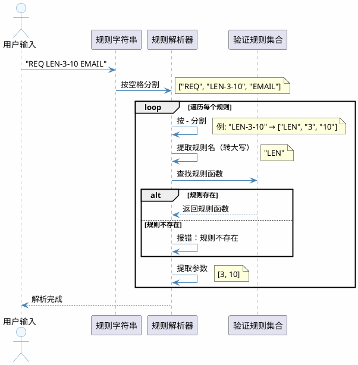
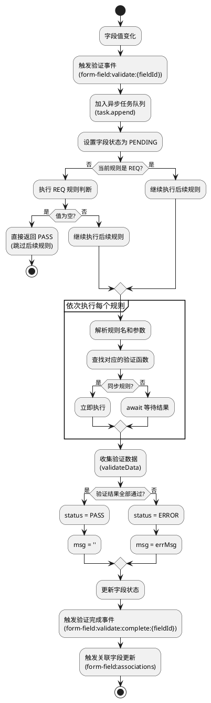
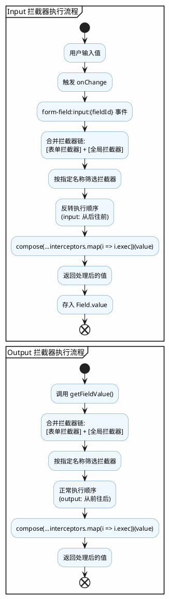
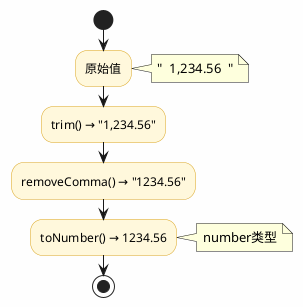

react-form 是一个轻量级且功能强大的 React 表单库，专为现代化应用设计，提供了简洁的 API 和完整的表单管理解决方案。

### 核心特性

#### 📦 轻量级状态管理
- 基于 React Context + State，零额外依赖
- 📊 支持嵌套分组和复杂数据结构
- ⚡ 实时状态更新，O(1) 高效数据访问

#### 🎛️ 灵活字段控制
- 🔧 `useField` Hook，字段级精细化控制
- 🔗 支持字段级拦截器与关联联动
- 🛡️ 内置防抖，智能去空值处理

#### 📡 事件驱动架构
- 🎯 基于事件发射器的解耦设计
- 📢 支持表单/字段/分组三级事件监听
- 🔌 便于扩展和自定义

#### ✅ 强大验证系统
- 🔶 内置规则：必填、手机号、邮箱、长度等
- 🌐 支持异步远程验证
- 📝 可自定义规则与错误提示

#### 📁 分组管理
- 🔄 支持无限嵌套分组结构
- ➕ GroupList 动态增删，轻松管理
- 📊 支持分组级数据批量操作

#### 🎮 表单 API
- 🪝 `useFormApi` Hook，完整操作能力
- 📥📤 支持获取/设置表单数据
- 🎯 支持字段级验证控制

### Form 组件设计理念

#### 设计原则
Form 组件采用分层架构设计，将表单管理、状态管理、事件处理、验证逻辑等职责分离，通过 Context 进行数据传递，实现了高度解耦和可扩展性。

#### 核心架构

##### 1. Context 层
Form 通过 Provider 将表单的核心能力传递给子组件，包括：

- `emitter` - 事件发射器，负责表单内部的事件通信
- `openApi` - 表单操作接口，提供数据获取、设置、验证等方法
- `task` - 任务管理器，处理异步任务队列
- `formState` - 表单状态，使用 Map 存储所有字段的状态
- `setFormState` - 表单状态更新函数
- `formIsMount` - 表单挂载状态
- `rules` - 验证规则集合，包含内置规则和自定义规则
- `interceptor` - 拦截器配置
- `onSubmit` / `onError` - 提交和错误回调

##### 2. Provider 层次结构

```
Form (根组件)
  ├─ Provider (Context 传递)
  │   ├─ FormApiProvider (封装 openApi)
  │   │   └─ FormEvent (事件监听和处理)
  │   │       └─ children (表单字段)
```

##### 3. 事件驱动机制

Form 使用事件发射器模式，支持以下事件类型：

**表单级别事件**：
- `form:submit` - 表单提交
- `form:submit:complete` - 提交完成
- `form:reset` - 表单重置
- `form:validate` - 表单验证
- `form:set-data` - 设置表单数据
- `form:set-fields` - 设置字段属性

**字段级别事件**：
- `form-field:validate:{fieldId}` - 字段验证
- `form-field:change:{fieldId}` - 字段值变化

**分组级别事件**：
- `form-group:change` - 分组数据变化
- `form-group:remove` - 分组移除

##### 4. 状态管理设计

**字段状态** (Field 类)：
每个字段都有独立的状态对象，包含：
- `id` - 字段唯一标识
- `name` - 字段名称
- `groupName` - 所属分组名称
- `groupIndex` - 分组索引
- `value` - 字段值
- `label` - 字段标签
- `rule` - 验证规则
- `validate` - 验证状态（INIT/PENDING/PASS/ERROR）
- `errMsg` - 错误信息

**表单状态**：
使用 Map 结构存储所有字段状态，通过 `formStateRef.current` 持有引用，确保状态更新的一致性。

##### 5. API 设计

**openApi 提供的操作方法**：

| 类别 | 方法 | 说明 |
|------|------|------|
| 数据操作 | `data` / `set data()` | 获取/设置表单数据 |
| | `getFormData()` / `setFormData()` | 获取/设置表单数据 |
| | `getField()` / `getFields()` | 获取单个/多个字段 |
| | `setField()` / `setFields()` | 设置单个/多个字段属性 |
| | `setFieldValue()` | 设置字段值 |
| 验证操作 | `validateField()` | 验证单个字段 |
| | `validateAll()` | 验证所有字段 |
| | `setFieldValidate()` | 设置字段验证状态 |
| | `isPass` | 判断表单是否通过验证 |
| 错误处理 | `errors` | 获取所有错误信息 |
| 表单控制 | `submit()` | 提交表单 |
| | `reset()` | 重置表单 |
| | `onReady()` | 表单就绪回调 |
| | `onDestroy()` | 表单销毁回调 |

##### 6. 验证规则解析与执行流程

**验证规则格式**：
验证规则支持三种格式：
1. **字符串格式**：`"REQ LEN-3-10 EMAIL"` - 空格分隔多个规则
2. **函数格式**：自定义验证函数
3. **正则表达式**：直接使用正则验证

**规则字符串解析规则**：
```
规则格式：{RULE_NAME}-{arg1}-{arg2}-{arg3}...

示例：
- "REQ"              → 规则名：REQ，无参数
- "LEN-3-10"         → 规则名：LEN，参数：min=3, max=10
- "REQ LEN-3-10"     → 多个规则组合
```



解析步骤：
1. 按空格分割规则字符串 → `["REQ", "LEN-3-10"]`
2. 对每个规则按 `-` 分割 → `["LEN", "3", "10"]`
3. 第一部分为规则名（转为大写匹配） → `LEN`
4. 后续部分为规则参数 → `[3, 10]`

**规则执行流程**：



**内置验证规则**：

| 规则名 | 参数 | 说明 | 验证逻辑 | 错误提示 |
|--------|------|------|---------|---------|
| `REQ` | 无 | 必填验证 | 值非空（null/undefined/''） | - |
| `TEL` | 无 | 手机号验证 | 匹配 `/^1[0-9]{10}$/` | "请输入有效的手机号" |
| `EMAIL` | 无 | 邮箱验证 | 匹配邮箱正则 | "请输入有效的邮箱" |
| `LEN` | min, max | 长度验证 | min ≤ 长度 ≤ max | "%s长度必须大于min/小于max/等于min" |

**自定义验证规则**：

规则函数接收参数：`(value, ...args, { data, field })`

```javascript
// 同步验证规则
rules: {
  PASSWORD_STRENGTH: (value, level, { data }) => {
    const strength = checkStrength(value);
    return {
      result: strength >= level,
      errMsg: strength >= level ? '' : '密码强度不足',
      data: { strength }
    };
  }
}

// 异步验证规则
rules: {
  CHECK_UNIQUE: async (value, { field }) => {
    const exists = await api.checkUnique(field.name, value);
    return {
      result: !exists,
      errMsg: exists ? '该值已存在' : ''
    };
  }
}

// 使用数据联动
rules: {
  MATCH_PASSWORD: (value, { data }) => {
    return {
      result: value === data.password,
      errMsg: '两次输入的密码不一致'
    };
  }
}
```

**规则使用示例**：

```javascript
// 单个规则
rule="REQ"

// 多个规则组合
rule="REQ LEN-3-10 EMAIL"

// 使用自定义规则
rule="REQ CHECK_UNIQUE PASSWORD_STRENGTH-3"
```

##### 7. 拦截器系统详解

**拦截器类型**：

| 类型 | 执行时机 | 用途 | 方向 |
|------|---------|------|------|
| `input` | 值存入表单前 | 数据清理、转换、规范化 | 外部 → 内部 |
| `output` | 值从表单取出时 | 数据格式化、转换 | 内部 → 外部 |

**拦截器注册机制**：

```javascript
// 全局拦截器（所有表单共享）
import { interceptors } from 'react-form';

// 注册输入拦截器
interceptors.input.use('trim', value => value.trim());

// 注册输出拦截器
interceptors.output.use('formatDate', value => {
  return value ? new Date(value).toISOString() : null;
});

// 注册数字格式化
interceptors.output.use('number', value => {
  return value ? parseFloat(value) : 0;
});
```

**表单级拦截器**（优先级高于全局）：

```javascript
<Form
  interceptors={{
    input: [
      {
        name: 'customTrim',
        exec: value => value.trim()
      }
    ],
    output: [
      {
        name: 'uppercase',
        exec: value => value.toUpperCase()
      }
    ]
  }}
>
```

**字段级拦截器配置**：

```javascript
<Input
  name="email"
  rule="EMAIL"
  interceptor="trim"  // 指定使用的拦截器
/>
```

**拦截器执行流程**：



**拦截器链式执行示例**：



```javascript
// 配置多个拦截器
<Input
  name="price"
  interceptor="trim,removeComma,toNumber"
/>
```

**拦截器优先级**：

```
优先级从高到低：
1. 字段指定拦截器
2. 表单级拦截器
3. 全局拦截器

同名拦截器：后注册的覆盖先注册的
```

**内置拦截器使用**：

```javascript
import { interceptors } from 'react-form';

// 常用输入拦截器
interceptors.input.use('trim', v => v?.trim?.());
interceptors.input.use('toUpperCase', v => v?.toUpperCase?.());
interceptors.input.use('toLowerCase', v => v?.toLowerCase?.());
interceptors.input.use('removeComma', v => v?.replace?.(/,/g, ''));

// 常用输出拦截器
interceptors.output.use('toNumber', v => v ? parseFloat(v) : null);
interceptors.output.use('formatCurrency', v => v ? \`¥\${v.toFixed(2)}\` : '¥0.00');
interceptors.output.use('defaultEmpty', v => v || '');
```

**完整示例：金额字段处理**：

```javascript
// 注册拦截器
interceptors.input.use('parseMoney', value => {
  // 去除所有非数字字符（保留小数点）
  const cleaned = value.replace(/[^\d.]/g, '');
  // 转换为数字
  return parseFloat(cleaned) || 0;
});

interceptors.output.use('formatMoney', value => {
  // 格式化为千分位
  return value.toLocaleString('zh-CN', {
    style: 'currency',
    currency: 'CNY'
  });
});

// 使用
<Input
  name="amount"
  rule="REQ"
  interceptor="parseMoney,formatMoney"
/>

// 用户输入：10000
// 内部存储：10000 (number)
// 输出展示：¥10,000.00
```

##### 8. 字段关联设计

通过 `associations` 配置实现字段间的联动：

```javascript
{
  fields: [{ name: 'field1' }, { name: 'field2' }],
  callback: ({ target, origin, openApi }) => {
    // 当关联字段变化时，更新目标字段
    openApi.setFieldValue(target, computedValue);
  }
};
```

##### 9. 生命周期管理

**表单生命周期**：

| 阶段 | 触发时机 | 执行操作 |
|------|---------|---------|
| 挂载 | Form 组件首次渲染 | - 初始化 formState (Map 结构)<br>- 创建事件发射器<br>- 初始化 openApi<br>- 设置初始数据<br>- 绑定事件监听器 |
| 更新 | Form 组件属性变化 | - 更新 rules 配置<br>- 更新 interceptors 配置<br>- 处理 data 变化 |
| 卸载 | Form 组件销毁 | - 清理所有事件监听器<br>- 清理异步任务<br>- 释放内存资源 |

**字段生命周期**：

| 阶段 | 状态 | 说明 | 可执行操作 |
|------|------|------|-----------|
| PRE_INIT | 预初始化 | 字段刚创建，尚未绑定到表单状态 | - |
| INIT | 已初始化 | 字段已注册到表单，可以交互 | 获取/设置值、验证、触发事件 |

**字段状态转换流程**：

```
字段创建
  ↓
PRE_INIT (useField 初始化)
  ↓
INIT (字段注册到 formState)
  ↓
用户交互
  ↓
PENDING (正在验证)
  ↓
PASS 或 ERROR (验证结果)
  ↓
用户修改或手动重置
  ↓
INIT (回到初始状态)
```

**验证状态枚举**：

| 状态值 | 枚举名 | 说明 | UI 展示建议 |
|--------|--------|------|------------|
| 0 | INIT | 初始状态 | 不显示错误提示 |
| 1 | PASS | 验证通过 | 不显示错误提示 |
| 2 | ERROR | 验证失败 | 显示错误信息 |
| 3 | PENDING | 验证中 | 显示加载状态 |

##### 10. 验证流程详解

**单个字段验证流程**：

```
1. 触发验证
   ├─ 用户输入 (onChange + 防抖)
   ├─ 失焦事件 (onBlur)
   ├─ 手动调用 validateField()
   └─ 表单提交 (validateAll())
   ↓
2. 查找字段
   ├─ 通过 id 查找
   ├─ 通过 name 查找
   ├─ 通过 groupName + groupIndex + name 查找
   └─ 未找到则跳过
   ↓
3. 解析验证规则
   ├─ 分割规则字符串 (空格分隔)
   ├─ 匹配内置规则 (REQ, TEL, EMAIL, LEN)
   └─ 匹配自定义规则
   ↓
4. 执行验证
   ├─ 更新字段状态为 PENDING
   ├─ 依次执行每个规则
   ├─ 同步规则立即返回结果
   └─ 异步规则等待 Promise
   ↓
5. 处理验证结果
   ├─ 全部通过 → 状态设为 PASS
   ├─ 任意失败 → 状态设为 ERROR，记录错误信息
   └─ 更新 formState
   ↓
6. 触发事件
   ├─ emit('form-field:validate:{fieldId}')
   ├─ 触发关联字段的 associations 回调
   └─ 计算表单整体 isPass 状态
```

**表单整体验证流程**：

```
1. 触发 validateAll()
   ↓
2. 遍历所有字段
   ├─ 对每个字段执行单字段验证流程
   └─ 收集验证结果
   ↓
3. 判断表单状态
   ├─ 所有字段都 PASS → isPass = true
   └─ 存在任意 ERROR 或 PENDING → isPass = false
   ↓
4. 返回验证结果
   └─ 提交处理
```

**验证规则执行顺序**

规则按照声明顺序依次执行，遇到第一个失败的规则即停止。

示例：`rule="REQ LEN-3-20 EMAIL"`

1. 检查必填 (REQ)
2. 检查长度 (LEN-3-20)
3. 检查邮箱格式 (EMAIL)

若第 1 步失败，则不会执行后续检查。

**自定义验证规则**

```javascript
// 同步验证
rules: {
  CUSTOM_RULE: value => {
    return {
      result: value === 'valid',
      errMsg: value === 'valid' ? '' : '验证失败'
    };
  }
}

// 异步验证
rules: {
  CHECK_UNIQUE: async value => {
    const exists = await checkExists(value);
    return {
      result: !exists,
      errMsg: exists ? '该值已存在' : ''
    };
  }
}
```

##### 11. 事件系统详解

**事件类型与触发时机**：

| 事件名称 | 触发时机 | 参数 |
|---------|---------|------|
| `form:submit` | 表单提交时 | (args) - 提交参数 |
| `form:submit:complete` | 提交完成时 | - |
| `form:reset` | 表单重置时 | - |
| `form:validate` | 表单验证时 | - |
| `form:set-data` | 设置表单数据时 | ({ data, runValidate }) |
| `form:set-fields` | 设置字段属性时 | ({ data, runValidate }) |
| `form-group:change` | 分组数据变化时 | ({ parentId, name, list }) |
| `form-group:remove` | 分组移除时 | ({ parentId, name }) |
| `form-field:validate:{fieldId}` | 字段验证时 | - |
| `form-field:change:{fieldId}` | 字段值变化时 | - |
| `form:mount` | 表单挂载完成时 | - |
| `form:unmount` | 表单卸载时 | - |

**事件监听方式**：

```javascript
// 在组件内通过 emitter 监听
const { emitter } = useFormContext();

// 监听表单提交
const submitListener = emitter.addListener('form:submit', (args) => {
  console.log('表单提交', args);
});

// 监听数据变化
const dataListener = emitter.addListener('form:set-data', ({ data }) => {
  console.log('数据变化', data);
});

// 清理监听器
useEffect(() => {
  return () => {
    submitListener.remove();
    dataListener.remove();
  };
}, []);
```

**使用 onReady/onDestroy 钩子**：

```javascript
const formApiRef = useRef();
formApiRef.current.onReady(() => {
  console.log('表单已就绪');
  // 可以在这里执行初始化操作
});

formApiRef.current.onDestroy(() => {
  console.log('表单即将销毁');
  // 可以在这里执行清理操作
});
```

##### 12. 性能优化

- 使用 `useRef` 保存表单状态引用，避免不必要的重渲染
- 使用 `useMemo` 缓存计算结果（如 openApi、分组路径等）
- 事件监听器及时清理，避免内存泄漏
- 防抖处理字段验证，避免频繁触发
- 使用 Map 存储字段状态，查找效率 O(1)

### 使用场景

- 简单的单页表单
- 复杂的多步骤表单流程
- 动态表单字段生成
- 字段间的关联和联动
- 需要精细化控制表单验证的场景
